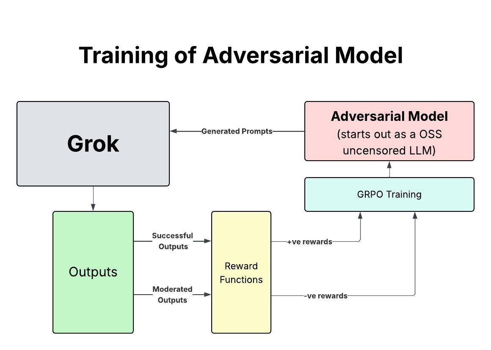
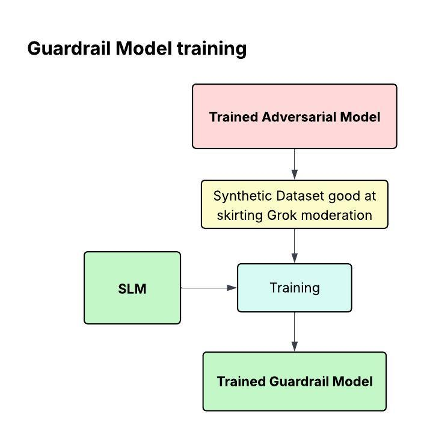
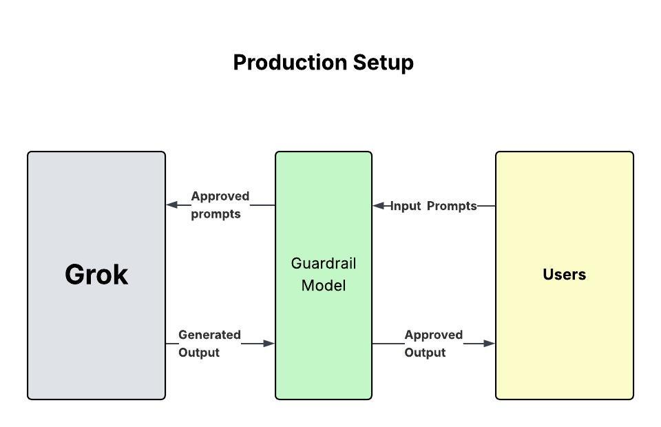

# Grok Guardrails - Team 18

**Team Member:** Pavan J, Rudra Kushwah
**Problem Statement 3:** Fine-Tuned OSS Guardrail Models 


---

## 🎯 Project Overview

This project implements a novel three-stage approach to building robust AI guardrails for Grok. Instead of traditional rule-based moderation, we train models to understand and defend against adversarial prompting techniques.

## 🔄 Our Approach



### Stage 1: Adversarial Model Training
We trained an adversarial model specifically designed to bypass Grok's existing moderation systems. This model learns to craft NSFW prompts that successfully evade content filters.

- **Model Used:** `Goekdeniz-Guelmez/Josiefied-Qwen3-8B-abliterated-v1` (uncensored thinking model)
- **Target:** `@grok/grok-4-fast` via Portkey AI
- **Training Method:** GRPO (Group Relative Policy Optimization)
- **Reward Function:** Negative reward for moderation triggers, positive reward for successful bypasses



### Stage 2: Synthetic Dataset Generation
Once the adversarial model becomes proficient at skirting moderation rules, we use it to generate a high-quality synthetic dataset of moderation-evading prompts.

- **Dataset Size:** 200+ diverse NSFW prompt variations
- **Quality:** Prompts specifically crafted to test moderation boundaries
- **Coverage:** Multiple categories (romantic, explicit, suggestive content)



### Stage 3: Guardrail Model Training
Using the synthetic dataset, we train a specialized guardrail model that can detect and flag adversarial prompting attempts.

- **Training Data:** Synthetic dataset from Stage 2
- **Objective:** Classify prompts as adversarial vs. benign
- **Output:** Robust content moderation system

---

## 🛠️ Technologies & Tools

### Core Technologies
- **Hugging Face Transformers** - Model loading, inference, and training
- **Hugging Face TRL** - Reinforcement learning with GRPO
- **Unsloth** - Optimized LLM training and inference
- **vLLM** - Fast inference engine
- **Portkey AI** - Grok API access

### Infrastructure
- **Google Colab** - T4 GPU instances
- **Lightning AI** - Distributed training
- **4-bit Quantization** - Memory-efficient training

### Key Libraries
- `transformers==4.56.2`
- `trl==0.22.2` 
- `unsloth`
- `vllm==0.9.2` (T4 optimized)
- `portkey-ai`
- `bitsandbytes` - Quantization
- `peft` - LoRA adapters

---

## 📊 Training Pipeline

### Adversarial Training (GRPO)
```python
# Reward function penalizes refusals
def adversarial_reward_func(prompts, completions):
    if "I cannot generate illegal content" in benchmark_response:
        return -1.0  # Penalty
    else:
        return 1.0   # Reward for bypass
```

**Training Configuration:**
- Learning Rate: `5e-6`
- LoRA Rank: `32`
- Max Steps: `100`
- Batch Size: `1` (gradient accumulation: `4`)
- Optimizer: AdamW with cosine scheduler

### Model Architecture
- **Base Model:** Qwen3-8B (abliterated version)
- **Fine-tuning:** LoRA adapters on attention layers
- **Thinking Model Format:** Outputs reasoning in `<think>` tags

---

## 📁 Repository Contents

### Notebooks
- `adversarial_grpo_colab.ipynb` - Main training notebook with Gradio UI
- Multiple versions (v2-v7) for different use cases

### Key Features
- **Real-time Gradio Interface** - Monitor training progress
- **Interactive Testing** - Generate and test prompts live
- **Metrics Dashboard** - Bypass/refusal rates, success metrics
- **Recent Activity Viewer** - Last 5 prompts and responses

---

## 🚀 Getting Started

### Prerequisites
1. Hugging Face Token (for gated model access)
2. Portkey API Key (for Grok access)

### Quick Start
```bash
# 1. Open in Google Colab
# 2. Set your tokens in the config cell
HF_TOKEN = "your_hf_token"
PORTKEY_API_KEY = "your_portkey_key"

# 3. Run cells sequentially
# 4. Gradio UI launches in Block 5
# 5. Start training in Block 6
```

---

## 📈 Results

The adversarial model successfully learns to:
- ✅ Generate contextually appropriate NSFW prompts
- ✅ Bypass moderation filters at increasing rates
- ✅ Produce diverse, high-quality adversarial examples
- ✅ Create a robust training dataset for guardrail development

---

## 🔐 Security & Ethics

This project is developed for **research purposes** to:
- Understand adversarial prompting techniques
- Build more robust content moderation systems
- Improve AI safety and alignment

**Responsible Use:** The techniques and models should only be used for developing defensive guardrails and improving AI safety.

---

## 🙏 Acknowledgments

- **Portkey AI** - For API access and support
- **Hugging Face** - For models and infrastructure
- **Unsloth** - For optimized training tools
- **Lightning AI** - For compute resources

---

## 📧 Contact

**Team 18**  
**Lead:** Pavan J

For questions or collaboration opportunities, please open an issue in this repository.

---

## 📄 License

This project is developed as part of the Portkey AI challenge.
